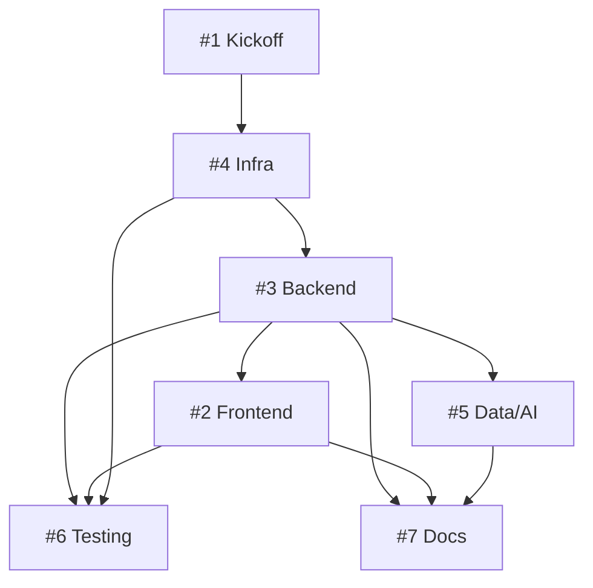

# Sprint 1 Plan — TaskFlow AI-Powered Project Management Platform

**Sprint Duration:** 2 weeks (10 working days)
**Sprint Dates:** July 20 – July 31, 2026
**Team:** 7 engineers (Alex, Samira, Javier, Priya, Marco, Fatima, Elena)
**Milestone:** Sprint 1 — Foundation & Core Infrastructure

---

## Sprint Goal

> **Establish the complete technical foundation for TaskFlow:** provisioned AWS infrastructure, operational FastAPI backend with authentication and task CRUD APIs, React frontend skeleton with task board UI prototype, foundational data model with AI integration stub, automated test infrastructure, and baseline documentation. By sprint end, the team can run the full stack locally, deploy to AWS via CI/CD, and iterate on features in Sprint 2.

---

## Priorities (Ranked by Importance)

| Rank | Priority | Issue | Owner | Rationale |
|------|----------|-------|-------|-----------|
| 1 | **HIGH** | **#4 — AWS Infrastructure** | **Priya Sharma** | Critical path. Everything depends on VPC, RDS, CI pipeline. Blocks #3, #6, deployment. |
| 2 | **HIGH** | **#1 — Kickoff, Planning, Architecture Review, Onboarding** | **Alex Martinez** | Coordination prerequisite. Unblocks parallel workstreams. Must complete Days 1–2. |
| 3 | **HIGH** | **#3 — FastAPI Backend (Auth + Task CRUD)** | **Javier Lopez** | Core product API. Frontend (#2), Data/AI (#5), Testing (#6), Docs (#7) all depend on it. |
| 4 | **MEDIUM** | **#2 — React Frontend Skeleton + Task Board UI** | **Samira Patel** | User-facing prototype. Depends on #3 (API contracts). Enables early UX validation. |
| 5 | **MEDIUM** | **#5 — Analytics Data Model + OpenAI Integration** | **Marco Rossi** | Differentiator feature. Depends on #3 (task API, DB). Can start data model in parallel. |
| 6 | **MEDIUM** | **#6 — Test Strategy + Automated Unit Tests** | **Fatima Al-Sayed** | Quality gate. Depends on #2, #3 (code to test), #4 (CI pipeline). Can draft plan early. |
| 7 | **LOW** | **#7 — Documentation Suite** | **Elena Kovac** | Depends on #2, #3, #5 (API docs, user guide). Can draft templates in parallel. |

---

## Task Sequencing (What Must Be Done First)

### Phase 1: Foundation (Days 1–3)
**Must complete before any other development can proceed meaningfully.**

1. **Day 1–2:** **Issue #1 — Sprint Kickoff & Onboarding** (Alex)
   - Kickoff meeting, architecture review sign-off, repo access, AWS/GitHub onboarding
   - Output: Sprint plan finalized, team unblocked, architecture baseline approved

2. **Day 1–3 (parallel with #1):** **Issue #4 — AWS Infrastructure** (Priya)
   - AWS account/org setup, IAM roles, VPC (public/private subnets), security groups
   - RDS PostgreSQL provisioned, reachable from dev machines
   - GitHub Actions CI pipeline: lint → test → build (stub tests pass)
   - S3 + CloudFront stub for static assets
   - Infra diagram + runbook documented

**Gate:** RDS endpoint reachable; CI runs green on `main` → **unblocks #3, #6**

---

### Phase 2: Core Backend (Days 3–7)
**Starts as soon as Phase 1 gate passes. Frontend and Data work can prep in parallel.**

3. **Day 3–7:** **Issue #3 — FastAPI Backend** (Javier)
   - Scaffold FastAPI project (modular structure, config management, alembic)
   - PostgreSQL connection + migrations (uses Priya's RDS)
   - JWT auth: register, login, refresh, logout, role-based access (Admin/Manager/Member/Viewer)
   - Task CRUD endpoints with Pydantic validation, OpenAPI docs
   - Unit tests for auth + task CRUD (pytest)
   - **Gate:** All endpoints return 200 on CI; OpenAPI spec published

**Parallel prep (Days 3–5, no CI gate):**
- **Samira (#2):** Scaffold React + Vite + Redux Toolkit; folder structure; layout components (Header, Sidebar, BoardContainer)
- **Marco (#5):** Design analytics schema (task_metrics, suggestions tables); draft ETL flow; stub OpenAI client with env-keyed mock
- **Fatima (#6):** Draft Test Plan doc; define pytest/RTL conventions; configure test fixtures
- **Elena (#7):** Outline doc structure; draft CONTRIBUTING.md template

---

### Phase 3: Frontend + Data + Tests (Days 7–10)

4. **Day 7–10:** **Issue #2 — React Frontend** (Samira)
   - Connect to Javier's API (auth context, task API client)
   - Task board UI: 4 columns (To Do / In Progress / Review / Done), drag-and-drop (dnd-kit or similar)
   - Responsive layout (desktop + mobile breakpoint)
   - README with local dev instructions

5. **Day 7–10:** **Issue #5 — Data Model + OpenAI** (Marco)
   - Run migrations for analytics tables
   - ETL stub: extract task events → transform → load to metrics table
   - OpenAI integration module (env-keyed, mocked in dev)
   - `/api/v1/suggestions` endpoint returning AI-generated task suggestions

6. **Day 7–10:** **Issue #6 — Test Infrastructure** (Fatima)
   - Backend: pytest suite running in CI (auth + task CRUD ≥ 80% coverage)
   - Frontend: React Testing Library component tests for board columns, task card
   - CI wired: `pytest` + `npm test` in GitHub Actions (Priya's pipeline)

7. **Day 8–10:** **Issue #7 — Documentation** (Elena)
   - Product overview (personas, goals, architecture summary)
   - API docs draft (from Javier's OpenAPI spec)
   - User guide: getting started, board basics
   - CONTRIBUTING.md with dev setup, PR process, commit conventions

---

## Dependency Graph (Issue → Depends On)

| Issue | Blocks | Blocked By |
|-------|--------|------------|
| #1 | — | — |
| #4 | #3, #6 | #1 (access) |
| #3 | #2, #5, #6, #7 | #4 |
| #2 | #6, #7 | #3 |
| #5 | #7 | #3 |
| #6 | — | #2, #3, #4 |
| #7 | — | #2, #3, #5 |

---

## Estimated Risks & Mitigations

| Risk | Likelihood | Impact | Mitigation | Owner |
|------|------------|--------|------------|-------|
| **AWS provisioning delays** (RDS, IAM, VPC quotas) | High | High (blocks #3, #6) | Priya starts Day 1; pre-request quota increases; use local Postgres for unblocked dev | Priya / Alex |
| **Javier blocked on DB schema decisions** | Medium | High | Alex facilitates architecture decision Day 2; Marco reviews data model early | Alex |
| **OpenAI API key / quota issues** | Medium | Medium | Marco uses mocked client in dev; real key only in staging; budget alert set | Marco / Priya |
| **Frontend blocked waiting for API contracts** | Medium | Medium | Javier publishes OpenAPI spec by Day 5; Samira builds against mock MSW handlers in parallel | Javier / Samira |
| **CI pipeline flakiness (GitHub Actions)** | Medium | Medium | Priya adds retry logic; Fatima adds test quarantine; run locally first | Priya / Fatima |
| **Drag-and-drop library integration complexity** | Low | Medium | Samira spikes dnd-kit vs react-beautiful-dnd Day 3; timebox 4h | Samira |
| **Documentation drift vs implementation** | High | Low | Elena reviews PRs; docs updated in same PR as code (Definition of Done) | Elena / Alex |
| **Team member availability (PTO, on-call)** | Low | Medium | Alex tracks capacity daily; pair programming for critical path | Alex |

---

## Sprint Capacity & Allocation

| Engineer | Role | Capacity (days) | Primary Issue | Secondary / Support |
|----------|------|-----------------|---------------|---------------------|
| Alex Martinez | Eng Manager | 10 | #1 | Sprint coordination, unblocking, code review |
| Priya Sharma | Cloud Eng | 10 | #4 | CI/CD maintenance, infra docs |
| Javier Lopez | Backend Eng | 10 | #3 | API contract review with Samira |
| Samira Patel | Frontend Eng | 10 | #2 | UI component library, RTL testing |
| Marco Rossi | Data Eng | 8 | #5 | Schema review with Javier |
| Fatima Al-Sayed | QA Eng | 8 | #6 | Test plan review, CI test integration |
| Elena Kovac | Tech Writer | 6 | #7 | Doc reviews, CONTRIBUTING.md |

> **Note:** Marco, Fatima, Elena at 80% capacity (part-time / shared). Alex splits 50/50 management + code review.

---

## Definition of Done (Sprint Level)

All must be ✅ for sprint completion:

- [ ] **#1** Kickoff done, architecture approved, all engineers have AWS/GitHub access, sprint board populated
- [ ] **#4** AWS infra live: VPC, RDS reachable, CI pipeline runs lint+test on PR, infra diagram + runbook in `/docs/infra`
- [ ] **#3** FastAPI app deployed to `dev` env: auth + task CRUD working, OpenAPI at `/docs`, unit tests ≥80% coverage on CI
- [ ] **#2** React app runs locally (`npm run dev`), connects to local backend, task board drag-and-drop works, responsive
- [ ] **#5** Analytics tables migrated, ETL stub runs, `/suggestions` endpoint returns mocked AI response, OpenAI key configurable
- [ ] **#6** Test plan doc approved, backend + frontend tests run in CI on every PR, coverage thresholds enforced
- [ ] **#7** Four docs published to `/docs`: product-overview.md, api-draft.md, user-guide.md, CONTRIBUTING.md

---

## Expected Sprint Outcome

At the end of Sprint 1, the team will have:

1. **Runnable full stack locally** — `docker-compose up` (or equivalent) spins up Postgres + FastAPI + React
2. **Deployable to AWS** — CI/CD pipeline builds and deploys backend + frontend to `dev` environment
3. **Authenticated task management API** — register, login, create/read/update/delete tasks with roles
4. **Working Kanban board UI** — drag-and-drop columns, task cards, responsive layout
5. **AI suggestion stub** — endpoint wired, mocked in dev, ready for prompt engineering in Sprint 2
6. **Test safety net** — automated tests on every PR, coverage gates
7. **Living documentation** — developers can onboard in <30 min using CONTRIBUTING.md + user guide

---

## Sprint 2 Preview (Planning Input)

| Epic | Description | Depends On Sprint 1 |
|------|-------------|---------------------|
| Real-time Collaboration | WebSocket updates, presence, comments | #2, #3 |
| Advanced Task Features | Subtasks, dependencies, labels, search | #3 |
| AI Task Suggestions v2 | Real OpenAI prompts, prompt engineering, feedback loop | #5 |
| Analytics Dashboard | Velocity, burndown, cumulative flow charts | #5 |
| Mobile PWA | Offline support, push notifications | #2 |
| Integrations | GitHub, Slack webhooks | #3, #4 |

---

## Issue Reference Quick Links

| # | Title | Owner | Priority | Labels | Link |
|---|-------|-------|----------|--------|------|
| 1 | Project kickoff, sprint planning, architecture review, onboarding | Alex Martinez | High | feature, high-priority | `#1` |
| 2 | React app skeleton + task board UI | Samira Patel | Medium | feature, medium-priority | `#2` |
| 3 | FastAPI auth + task CRUD | Javier Lopez | High | feature, high-priority | `#3` |
| 4 | AWS infra: VPC, RDS, CI | Priya Sharma | High | infrastructure, high-priority | `#4` |
| 5 | Analytics data model + OpenAI | Marco Rossi | Medium | feature, medium-priority | `#5` |
| 6 | Test strategy + automated tests | Fatima Al-Sayed | Medium | testing, medium-priority | `#6` |
| 7 | Documentation suite | Elena Kovac | Low | documentation, low-priority | `#7` |

---

*Document Version: 1.0*  
*Created: July 18, 2026*  
*Author: Alex Martinez (Engineering Manager)*  
*Approved By: [Pending Team Review]*